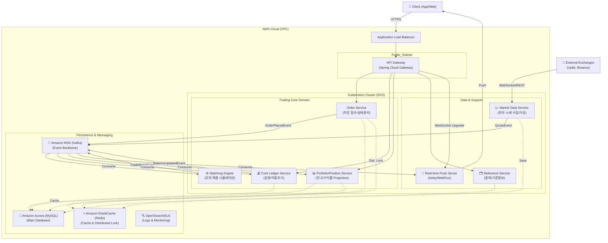

# Kuku Securities (쿠쿠증권) 📈

> **"Why"가 이끄는 기술적 의사결정, 그리고 극한의 안정성**
> MSA 기반의 고성능 증권 트레이딩 플랫폼 프로젝트입니다.

## 🏗 System Architecture (MSA)

이 프로젝트는 도메인별로 독립적인 마이크로서비스로 구성되어 있습니다.



| Module | Description | Port |
|--------|-------------|------|
| **[kuku-core-ledger](kuku-core-ledger/README.md)** | 원장 시스템 (계좌, 자산, 이중부기) | 8081 |
| **kuku-order-system** | 주문 시스템 (매수/매도, 동시성 제어) | 8082 |
| **kuku-market-data** | 시세 시스템 (실시간 시세, WebSocket) | 8083 |
| **kuku-api-gateway** | API 게이트웨이 (인증, 라우팅) | 8080 |
| **kuku-common** | 공통 유틸리티 및 도메인 객체 | - |

## 🛠 Tech Stack

- **Language**: Java 21
- **Framework**: Spring Boot 3.4.0
- **Database**: MySQL 8.0, Redis
- **Messaging**: Kafka
- **Build Tool**: Gradle (Multi-module)

## 🚀 Getting Started

### Prerequisites
- JDK 21
- Docker & Docker Compose

### Run Locally
```bash
# Start Infrastructure (MySQL, Redis, Kafka)
docker-compose up -d

# Build Project
./gradlew clean build
```
