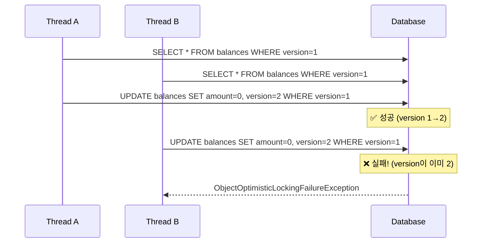

# 동시성 테스트 Deep Dive: ConcurrentWithdrawIntegrationTest

> **목적**: 이 문서는 금융 시스템에서 동시성 테스트가 **왜** 필요하고, **어떻게** 구현했으며, **무엇을** 증명하는지를 Why-Driven 방식으로 설명합니다.
> 면접에서 "동시성 문제를 어떻게 해결했나요?"라는 질문에 자신 있게 답변할 수 있도록 설계되었습니다.

---

## 1. Why: 이 테스트가 왜 필요한가?

### 1.1 금융 시스템의 치명적 버그: Race Condition

```
시나리오: 계좌 잔액 1,000원, 두 사용자가 동시에 1,000원 출금 시도
```

| 시간 | Thread A | Thread B | 실제 잔액 | 문제 |
|------|----------|----------|-----------|------|
| T1 | 잔액 조회: 1,000원 | - | 1,000원 | |
| T2 | - | 잔액 조회: 1,000원 | 1,000원 | |
| T3 | 잔액 >= 1,000? ✅ | - | 1,000원 | |
| T4 | - | 잔액 >= 1,000? ✅ | 1,000원 | ⚠️ 둘 다 통과! |
| T5 | 잔액 = 0 저장 | - | 0원 | |
| T6 | - | 잔액 = 0 저장 | 0원 (또는 음수) | 💥 **음수 잔액 또는 초과 출금** |

> [!CAUTION]
> **버그의 핵심**: 구현 방식에 따라 음수 잔액 또는 초과 출금(중복 처리)으로 나타납니다.
> 공통점은 **계좌의 불변식(invariant)이 깨진다**는 것입니다.
> - `잔액 - 출금액` 방식 → 음수 잔액 발생
> - `잔액 = 0` 방식 → 잔액은 0이지만 2,000원이 빠져나간 기록이 남음

**결과**: 계좌에는 1,000원만 있었지만 2,000원이 출금됨 → **금융 손실 발생**

### 1.2 단위 테스트의 한계

```java
// 단위 테스트 - 항상 성공 (순차 실행)
@Test
void 출금_테스트() {
    Balance balance = new Balance(1000);
    balance.withdraw(1000);
    assertThat(balance.getAmount()).isEqualTo(0);
}
```

**단위 테스트의 한계**:
- 일반적인 단위 테스트는 **순차적**으로 실행되어 Race Condition 재현이 어려움
- 동시성 버그는 **환경/타이밍 의존적**이라 재현성이 낮음 (flaky)
- DB 락/격리 수준/트랜잭션 경계까지 포함하면 **통합 테스트가 필수**
- Thread를 사용하는 단위 테스트도 가능하지만, 실제 DB 특성을 반영하지 못함

### 1.3 이 테스트가 증명하는 것

| 검증 항목 | 설명 |
|-----------|------|
| **Race Condition 방지** | 동시 요청 시 데이터 무결성 유지 |
| **낙관적 락 동작 확인** | `@Version` 기반 충돌 감지가 정상 작동 |
| **비즈니스 로직 정확성** | 잔액 부족 시 정확히 예외 발생 |
| **원장(Ledger) 정합성** | Transaction, JournalEntry, Balance가 일관된 상태 유지 |

---

## 2. What: 동시성 문제 해결 전략

### 2.1 낙관적 락 (Optimistic Locking)

우리 시스템은 **낙관적 락**을 사용하여 동시성을 제어합니다.

```java
// BalanceJpaEntity.java
@Entity
public class BalanceJpaEntity {
    
    @Version  // ← 핵심: JPA가 자동으로 버전 관리
    @Column(name = "version")
    private Long version;
    
    // ...
}
```

**동작 원리**:



### 2.2 왜 낙관적 락인가? (vs 비관적 락)

| 특성 | 낙관적 락 | 비관적 락 |
|------|-----------|-----------|
| **락 획득 시점** | 커밋 시 검증 | 조회 시 즉시 락 |
| **동시성** | 높음 (락 대기 없음) | 낮음 (락 대기 발생) |
| **충돌 시** | 예외 발생 → 재시도 필요 | 대기 후 순차 처리 |
| **DB 부하** | 낮음 | 높음 (락 관리 오버헤드) |
| **적합한 상황** | 충돌이 드문 경우 | 충돌이 빈번한 경우 |

> [!TIP]
> **금융 시스템에서 낙관적 락을 선택한 이유**:
> - 대부분의 출금 요청은 서로 다른 계좌에서 발생 (충돌 드묾)
> - 같은 계좌 동시 출금은 드문 케이스 (발생 시 재시도로 해결)
> - 높은 처리량(TPS) 유지가 중요

### 2.3 비즈니스 예외 vs 기술적 예외

테스트에서 두 가지 "기대되는 실패"를 구분합니다:

```java
ConcurrencyRunner.run(2, task, 
    InsufficientBalanceException.class,        // 비즈니스 예외
    ObjectOptimisticLockingFailureException.class  // 기술적 예외
);
```

| 예외 | 발생 조건 | 의미 |
|------|-----------|------|
| `InsufficientBalanceException` | 잔액 < 출금액 | 비즈니스 로직이 올바르게 거부 |
| `ObjectOptimisticLockingFailureException` | version 충돌 | 동시 수정 감지 → 기술적 보호 작동 |

---

## 3. How: 테스트 구현 상세

### 3.1 테스트 구조

```
┌─────────────────────────────────────────────────────────┐
│                ConcurrentWithdrawIntegrationTest        │
│  ┌──────────────────┐  ┌──────────────────────────────┐ │
│  │ ConcurrencyRunner│  │     LedgerTestFixture        │ │
│  │ (스레드 관리)    │  │ (데이터 생성/정리/검증)     │ │
│  └──────────────────┘  └──────────────────────────────┘ │
│            ↓                         ↓                   │
│  ┌─────────────────────────────────────────────────────┐│
│  │              WithdrawService (테스트 대상)          ││
│  └─────────────────────────────────────────────────────┘│
└─────────────────────────────────────────────────────────┘
```

### 3.2 ConcurrencyRunner 핵심 메커니즘

```java
// 모든 스레드가 동시에 시작하도록 보장
CountDownLatch startLatch = new CountDownLatch(1);

for (int i = 0; i < threadCount; i++) {
    executor.submit(() -> {
        startLatch.await();  // 모든 스레드가 여기서 대기
        task.run();          // 동시 실행!
    });
}

startLatch.countDown();  // 🚀 모든 스레드 동시 시작!
```

**왜 CountDownLatch인가?**:
- 스레드 생성 시간 차이로 인한 "순차 실행" 방지
- 진정한 동시성 상황 재현
- 경쟁 조건(Race Condition)을 의도적으로 유발

> [!NOTE]
> **Flaky 테스트 방지 전략**:
> - CountDownLatch를 써도 실제로 겹쳐 실행 안 될 수 있음 (OS 스케줄링 의존)
> - 충돌 재현성을 높이기 위해 `@RepeatedTest` 또는 loop 실행 고려
> - warm-up delay, barrier 기법으로 스레드 동기화 강화
> - **Testcontainers(MySQL)** 사용으로 실제 DB 락/격리 특성 반영

### 3.3 테스트 시나리오 분석

#### 시나리오 1: 전액 출금 경쟁

```java
@Test
@DisplayName("동시에 2개 스레드가 전체 잔액을 출금하면 하나만 성공해야 한다")
void 동시_전액_출금시_하나만_성공해야_한다() {
    // Given: 1000원 계좌
    BigDecimal initialBalance = new BigDecimal("1000");
    BigDecimal withdrawAmount = new BigDecimal("1000");
    
    // When: 2개 스레드가 동시에 1000원 출금 시도
    ExecutionResult result = ConcurrencyRunner.run(2, () -> {
        withdrawService.withdraw(command);
    }, InsufficientBalanceException.class, 
       ObjectOptimisticLockingFailureException.class);
    
    // Then: 정확히 1개만 성공
    assertThat(result.getSuccessCount()).isEqualTo(1);
    assertThat(result.getExpectedFailureCount()).isEqualTo(1);
    fixture.assertBalance(accountId, BigDecimal.ZERO);  // 잔액 0원
}
```

**검증 포인트**:
- ✅ 2개 중 **정확히 1개만** 성공해야 함
- ✅ 최종 잔액은 **정확히 0원**이어야 함
- ✅ 음수 잔액이 **절대** 발생하면 안 됨

#### 시나리오 2: 다중 스레드 부분 출금

```java
@Test
@DisplayName("10개 스레드가 동시에 100원씩 출금하면 데이터 정합성이 유지되어야 한다")
void 다중_스레드_동시_출금시_데이터_정합성_유지() {
    // Given: 1000원 계좌, 10개 스레드가 각 100원씩 출금
    // When: 동시 실행
    // Then: 성공 횟수 × 100원 = 차감된 금액
}
```

**핵심 검증 공식**:
```
최종 잔액 = 초기 잔액 - (성공 횟수 × 건당 금액)
```

이 공식이 **항상** 성립해야 데이터 정합성이 보장됩니다.

### 3.4 원장 정합성 검증 (Financial Integrity)

```java
// LedgerTestFixture.java
public void assertLedgerConsistency(Long accountId, 
                                     int expectedSuccessCount, 
                                     BigDecimal amountPerTx) {
    // 1. Transaction 개수 = 성공 횟수
    Long txCount = entityManager.createQuery(
        "SELECT COUNT(t) FROM TransactionJpaEntity t WHERE ...").getSingleResult();
    assertThat(txCount).isEqualTo(expectedSuccessCount);
    
    // 2. JournalEntry 개수 = 성공 횟수 (단일 계좌 관점)
    // ⚠️ 주의: 이 검증은 "1 Tx = 1 Entry" 가정
    Long journalCount = entityManager.createQuery(
        "SELECT COUNT(e) FROM JournalEntryJpaEntity e WHERE ...").getSingleResult();
    assertThat(journalCount).isEqualTo(expectedSuccessCount);
    
    // 3. JournalEntry 총액 = 성공 횟수 × 건당 금액
    BigDecimal expectedTotal = amountPerTx.multiply(new BigDecimal(expectedSuccessCount));
    BigDecimal actualTotal = entityManager.createQuery(
        "SELECT COALESCE(SUM(e.amount), 0) FROM JournalEntryJpaEntity e WHERE ...")
        .getSingleResult();
    assertThat(actualTotal).isEqualByComparingTo(expectedTotal);
}
```

> [!IMPORTANT]
> **복식부기(Double-Entry) 관점 주의**:
>
> 일반적인 복식부기에서는 1거래 = 최소 2개 엔트리(차변/대변)가 생깁니다.
> 현재 구현은 **단일 계좌 관점**으로 USER_CASH 계좌의 DEBIT만 기록하며,
> 상대 계좌(COMPANY_CASH)의 CREDIT은 별도 시스템에서 처리합니다.
>
> **검증 전략**:
> - 개수 검증은 구현 방식에 따라 다름 (`1 Tx = N Entry`)
> - **재무적 효과(SUM) 검증이 핵심**: 성공 횟수 × 금액 = DB 기록 총액
> - 전체 원장 균형(DEBIT = CREDIT across all accounts)은 별도 통합 테스트에서 검증

---

## 4. 면접 예상 질문 & 답변

### Q1: "동시성 문제를 어떻게 해결했나요?"

> **A**: JPA의 `@Version`을 활용한 **낙관적 락(Optimistic Locking)**을 사용했습니다.
>
> 1. **문제 정의**: 같은 계좌에 동시 출금 요청이 들어오면 Race Condition이 발생하여 잔액이 음수가 될 수 있습니다.
>
> 2. **해결 방법**: Balance 엔티티에 `@Version` 필드를 추가했습니다. JPA가 UPDATE 시 `WHERE version = ?`를 자동 추가하여, 먼저 커밋한 트랜잭션만 성공하고 나머지는 `ObjectOptimisticLockingFailureException`이 발생합니다.
>
> 3. **왜 낙관적 락인가?**: 대부분의 출금은 서로 다른 계좌에서 발생하므로 충돌이 드뭅니다. 비관적 락은 모든 요청에 락 대기가 발생하여 성능이 저하되지만, 낙관적 락은 충돌 시에만 재시도하면 됩니다.

### Q2: "이 동시성 테스트는 어떻게 동작하나요?"

> **A**: `CountDownLatch`를 사용하여 **모든 스레드가 동시에 시작**하도록 설계했습니다.
>
> 1. N개의 스레드를 생성하고 모두 `startLatch.await()`에서 대기시킵니다.
> 2. `startLatch.countDown()`을 호출하면 모든 스레드가 동시에 비즈니스 로직을 실행합니다.
> 3. 결과를 `ExecutionResult`에 수집하여 성공/예상 실패/예상치 못한 실패를 구분합니다.
> 4. 최종 상태(Balance, Transaction, JournalEntry)가 정합성을 유지하는지 검증합니다.

### Q3: "단위 테스트와 통합 테스트의 차이점은?"

> **A**: 
> - **단위 테스트**: `Balance.withdraw()` 메서드가 잔액을 올바르게 차감하는지 검증. 순차 실행.
> - **통합 테스트**: 실제 DB와 스레드를 사용하여 동시성 상황에서 시스템 전체가 정합성을 유지하는지 검증.
>
> 동시성 버그는 일반적인 단위 테스트로는 **재현이 어렵고 통합 테스트가 더 적합**합니다.
> Thread를 사용한 단위 테스트도 가능하지만 타이밍 의존적이라 flaky하고, DB 락/격리/트랜잭션 경계까지 포함한 검증은 통합 테스트가 더 신뢰할 수 있습니다.

### Q4: "테스트에서 실패가 '기대되는' 이유는?"

> **A**: 동시성 테스트에서 **모든 요청이 성공하면 오히려 문제**입니다.
>
> - 2개 스레드가 동시에 전액 출금을 시도하면, 당연히 1개는 실패해야 합니다.
> - 실패하지 않는다면 Race Condition 방지가 작동하지 않는 것입니다.
> - 우리는 "올바른 이유로 실패"하는지를 검증합니다:
> - `InsufficientBalanceException`: 비즈니스 로직이 잔액 부족을 감지
> - `ObjectOptimisticLockingFailureException`: 낙관적 락이 충돌 감지

### Q5: "프로덕션에서 재시도 로직은 어떻게 구현하나요?"

> **A**: 재시도는 **멱등성(Idempotency) 보장이 전제**입니다.
>
> **1. 멱등성 키 (businessRefId)**:
> ```java
> // WithdrawService.java
> if (isDuplicateTransaction(command.businessRefId())) {
>     log.warn("Duplicate transaction detected");
>     return;  // 중복 요청은 무시
> }
> ```
> - `businessRefId`는 Transaction 테이블에 **UNIQUE 인덱스**로 설정
> - 재시도 시에도 같은 `businessRefId`를 사용하면 중복 저널 생성 방지
>
> **2. 재시도 레이어**:
> - **Application Layer**에서 재시도하는 것이 권장됨
> - Domain Layer는 비즈니스 로직만, 재시도는 상위 레이어 책임
> ```java
> @Retryable(
>     value = ObjectOptimisticLockingFailureException.class,
>     maxAttempts = 3,
>     backoff = @Backoff(delay = 100, multiplier = 2, random = true)  // jitter
> )
> ```
>
> **3. Backoff/Jitter**:
> - 고정 delay는 "thundering herd" 문제 유발 가능
> - `random = true` 또는 exponential backoff로 DB 부하 분산
>
> 테스트에서는 "낙관적 락이 정상 작동하는지"를 검증하는 것이 목적이므로, 재시도는 별도 관심사입니다.

### Q6: "OptimisticLock 재시도하면 중복 저널 안 생기나요?"

> **A**: `businessRefId` + **UNIQUE 제약**으로 방지합니다.
>
> 1. 첫 시도에서 Transaction이 생성되면, `businessRefId`가 DB에 저장됨
> 2. 재시도 시 `isDuplicateTransaction()` 체크로 이미 존재하면 early return
> 3. DB 레벨에서도 UNIQUE 제약으로 이중 방어
>
> ```sql
> CREATE UNIQUE INDEX uk_transactions_business_ref_id 
>     ON transactions(business_ref_id);
> ```

---

## 5. 핵심 요약

| 항목 | 내용 |
|------|------|
| **테스트 목적** | 동시 출금 시 Race Condition 방지 및 데이터 정합성 검증 |
| **해결 전략** | JPA @Version 기반 낙관적 락 |
| **테스트 기법** | CountDownLatch로 동시 시작 보장 |
| **검증 대상** | Balance 정합성, Transaction/JournalEntry 개수 및 총액 |
| **기대 결과** | 성공 + 기대 실패 = 전체 스레드 수 |

---

## 6. 참고 자료

- [JPA Optimistic Locking](https://docs.jboss.org/hibernate/orm/6.4/userguide/html_single/Hibernate_User_Guide.html#locking-optimistic)
- [Spring @Transactional Deep Dive](file:///Users/myeonggu.jung/Desktop/MG/01-이직/01-개인프로젝트/kuku/docs/deep-dive/spring-transactional.md)
- [MySQL InnoDB Locking](https://dev.mysql.com/doc/refman/8.0/en/innodb-locking.html)
