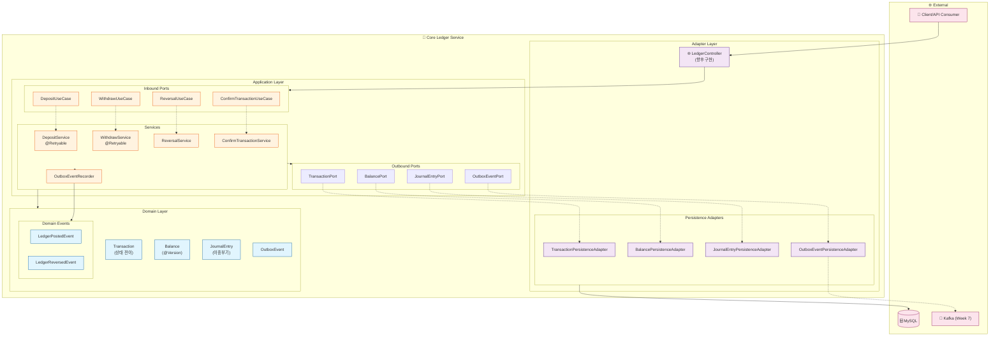
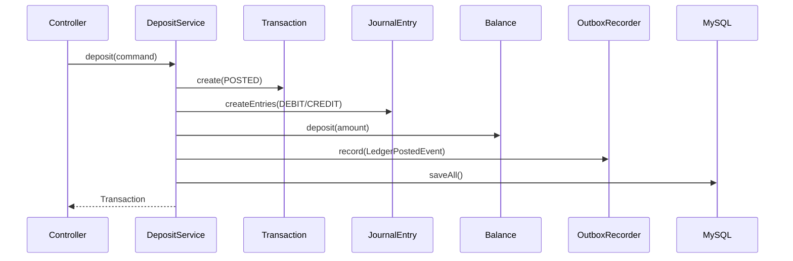

# C4 Component Diagram: Ledger Service 내부 구조

> Kuku Securities - Core Ledger 서비스의 컴포넌트 레벨 아키텍처

---

## 개요

이 다이어그램은 Ledger 서비스의 **Hexagonal Architecture (Ports & Adapters)** 기반 내부 구조를 보여줍니다.

---

## C4 Component Diagram

---

## 컴포넌트 상세

### Domain Layer

| 컴포넌트 | 책임 | 핵심 로직 |
|:---------|:-----|:---------|
| **Transaction** | 트랜잭션 생명주기 관리 | 상태 전이 (PENDING→POSTED→REVERSED) |
| **JournalEntry** | 이중부기 분개 기록 | DEBIT/CREDIT 엔트리, 역분개 |
| **Balance** | 계좌 잔액 관리 | Optimistic Lock (@Version) |
| **Account** | 계좌 정보 | USER_CASH, SYSTEM_FEE 등 |
| **OutboxEvent** | Outbox 이벤트 | PENDING→PROCESSED 상태 관리 |
| **LedgerEvent** | 도메인 이벤트 | LedgerPostedEvent, LedgerReversedEvent |

### Application Layer

| 컴포넌트 | 책임 | 특이사항 |
|:---------|:-----|:---------|
| **DepositService** | 입금 처리 | @Retryable 적용 |
| **WithdrawService** | 출금 처리 | 잔액 검증 포함 |
| **ReversalService** | 역분개 처리 | 원거래 상태 검증 |
| **ConfirmTransactionService** | PENDING 확정 | Week 7 외부 체결 연동용 |
| **OutboxEventRecorder** | Outbox 기록 | 도메인 이벤트 생성 |

### Adapter Layer

| 컴포넌트 | 책임 | 구현 |
|:---------|:-----|:-----|
| **TransactionPersistenceAdapter** | 트랜잭션 영속성 | JPA + Spring Data |
| **BalancePersistenceAdapter** | 잔액 영속성 | Optimistic Lock 처리 |
| **JournalEntryPersistenceAdapter** | 분개 영속성 | 배치 저장 지원 |
| **OutboxEventPersistenceAdapter** | Outbox 영속성 | 폴링 조회 지원 |

---

## 데이터 흐름

### 입금 플로우

---

## 기술 결정 사항

| 결정 | 선택 | 이유 |
|:-----|:-----|:-----|
| 동시성 제어 | Optimistic Lock | 읽기 비율 높음, 충돌 시 재시도 |
| 이벤트 발행 | Outbox 패턴 | 트랜잭션 보장, At-Least-Once |
| 상태 전이 | Domain Entity 캡슐화 | 불변식 보장 |
