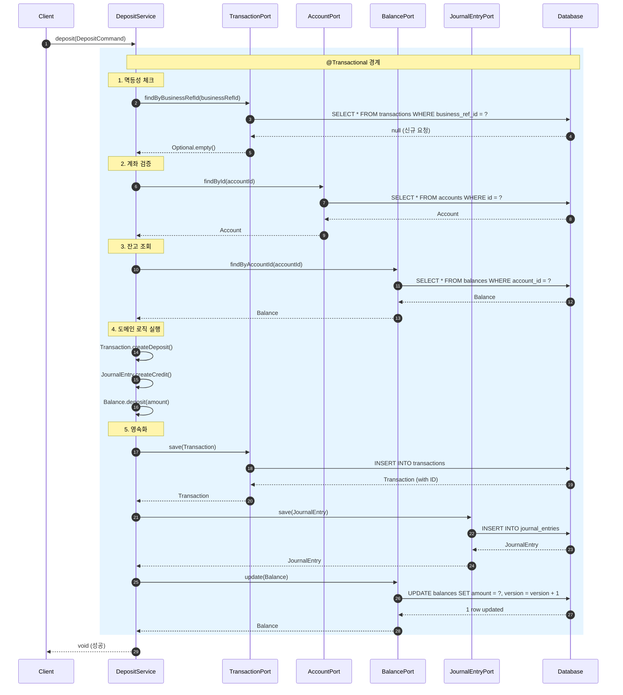
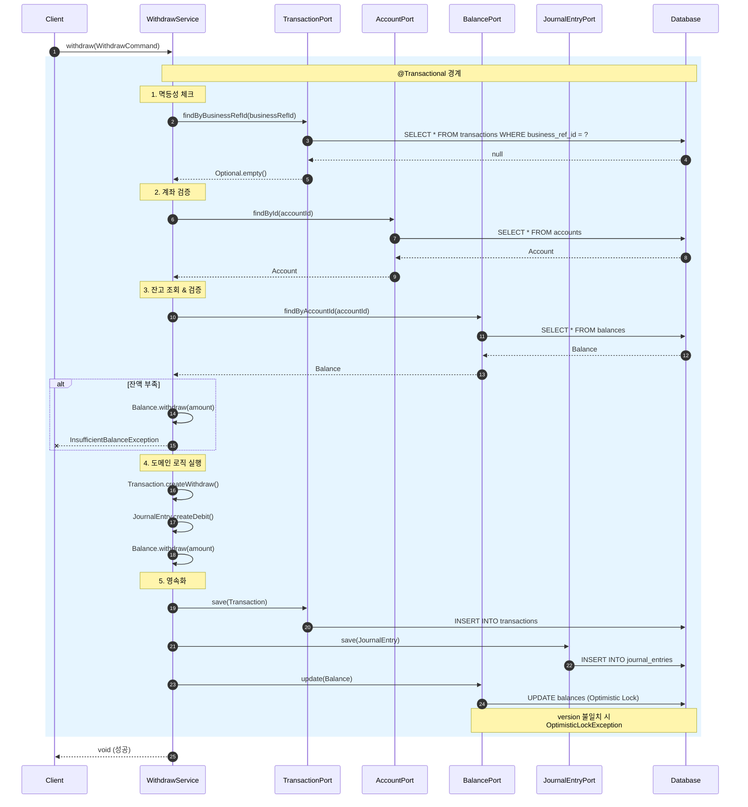

# 입출금 트랜잭션 Sequence Diagram

> 이 문서는 입금(Deposit)과 출금(Withdraw) 트랜잭션의 흐름을 설명합니다.

---

## 입금 (Deposit) 플로우

---

## 출금 (Withdraw) 플로우

---

## 주요 설계 원칙

### 1. 멱등성 (Idempotency)
- `businessRefId`로 중복 요청 감지
- 이미 처리된 요청은 재처리하지 않음

### 2. 낙관적 락 (Optimistic Lock)
- `Balance.version` 필드 활용
- 동시 수정 시 `ObjectOptimisticLockingFailureException` 발생

### 3. 이중 부기 (Double-Entry)
- 모든 거래는 `JournalEntry`로 기록
- `DEBIT`/`CREDIT`를 통한 추적 가능
