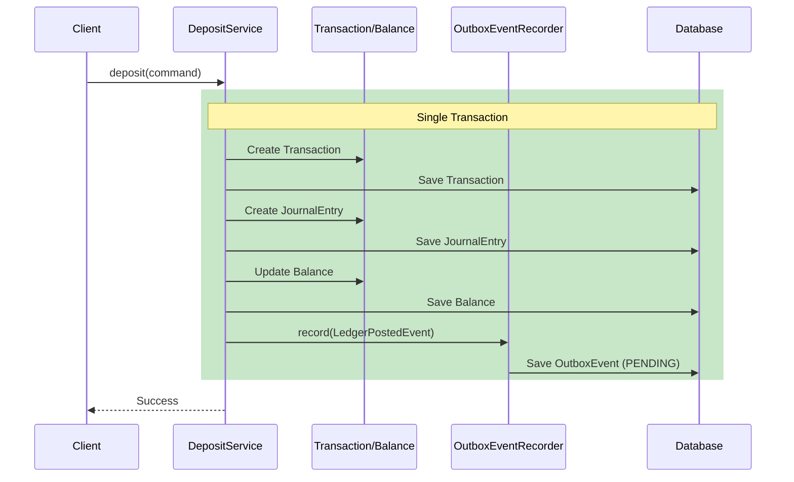
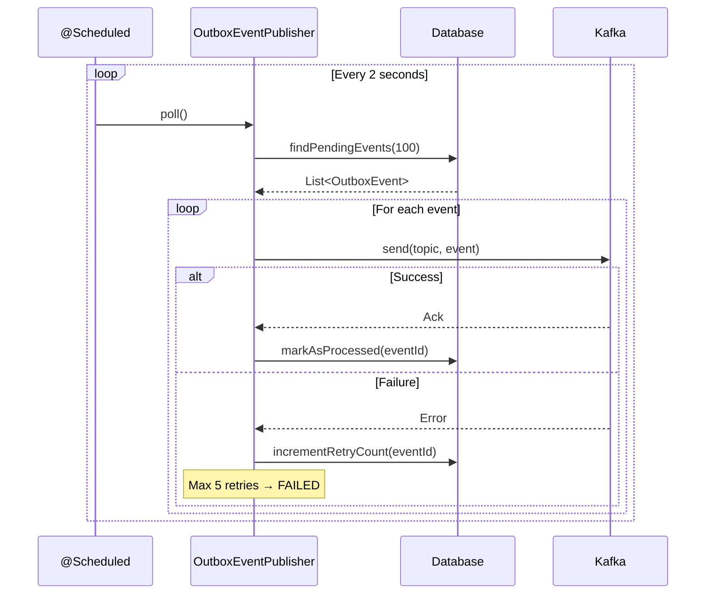
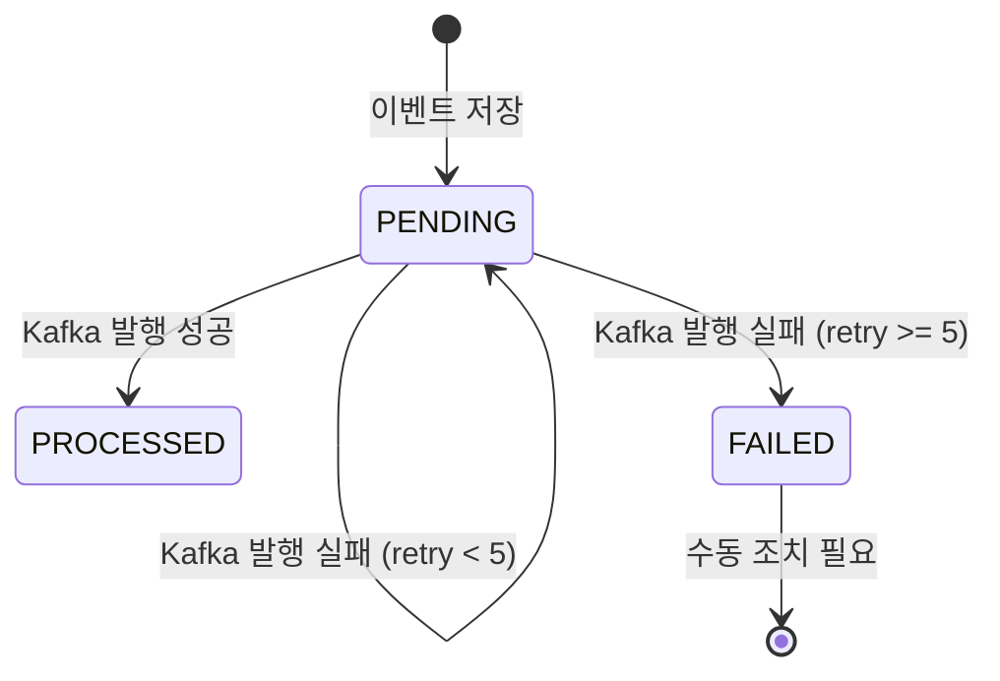

# Ledger 이벤트 흐름도

## Outbox 패턴 기반 이벤트 발행 흐름

## Kafka 발행 흐름 (PR 8 예정)

## 이벤트 타입

| Event Type | Trigger | Payload 주요 필드 |
|------------|---------|-------------------|
| `LEDGER_POSTED` | 입금/출금 완료 | transactionId, accountId, amount, transactionType |
| `LEDGER_REVERSED` | 역분개 완료 | reversalTransactionId, originalTransactionId, reason |

## Outbox Status 상태 전이

## 장점

1. **원자성 보장**: 비즈니스 로직과 이벤트 저장이 동일 트랜잭션
2. **신뢰성**: Kafka 다운 시에도 이벤트 유실 없음
3. **이벤트 재발행**: PENDING 상태로 남아있어 복구 가능
4. **감사 로그**: Outbox 테이블이 이벤트 히스토리 역할
