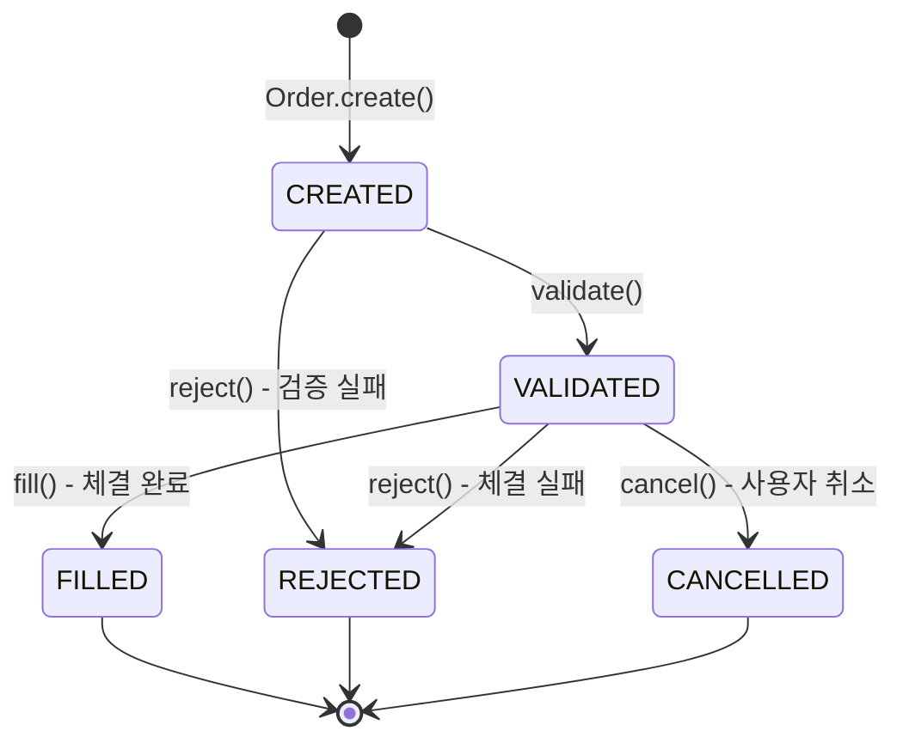

# Order State Machine Diagram

주문 생명주기를 관리하는 상태 머신 다이어그램입니다.

## State Diagram

## States

| 상태 | 설명 | 종료 상태 |
|------|------|-----------|
| `CREATED` | 주문이 접수됨 | ❌ |
| `VALIDATED` | 검증 완료 (예수금/보유수량 확보) | ❌ |
| `FILLED` | 체결 완료 | ✅ |
| `REJECTED` | 거부됨 (사유 포함) | ✅ |
| `CANCELLED` | 사용자에 의해 취소됨 | ✅ |

## Transition Rules

| From | To | Method | 조건 |
|------|-----|--------|-----|
| `CREATED` | `VALIDATED` | `validate()` | 검증 성공 |
| `CREATED` | `REJECTED` | `reject()` | 검증 실패 |
| `VALIDATED` | `FILLED` | `fill()` | 체결 완료 |
| `VALIDATED` | `REJECTED` | `reject()` | 체결 실패 |
| `VALIDATED` | `CANCELLED` | `cancel()` | 사용자 취소 |

## Rejection Reasons

| Reason | 설명 | 발생 시점 |
|--------|------|----------|
| `INSUFFICIENT_BALANCE` | 예수금 부족 | 매수 검증 시 |
| `INSUFFICIENT_QUANTITY` | 보유 수량 부족 | 매도 검증 시 |
| `MARKET_CLOSED` | 장 마감 | 검증 시 |
| `PRICE_SLIPPAGE` | 슬리피지 초과 | Week 7 |

## Related Files

- [Order.java](file:///Users/mg/Desktop/MG/01-이직/01-개인프로젝트/kuku/kuku-order-system/src/main/java/com/securities/kuku/order/domain/Order.java)
- [OrderStatus.java](file:///Users/mg/Desktop/MG/01-이직/01-개인프로젝트/kuku/kuku-order-system/src/main/java/com/securities/kuku/order/domain/OrderStatus.java)
- [ADR-010](file:///Users/mg/Desktop/MG/01-이직/01-개인프로젝트/kuku/docs/adr/010-order-state-machine-pattern.md)
