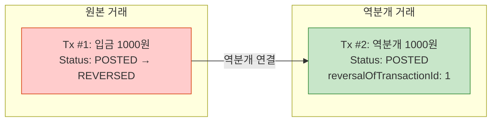
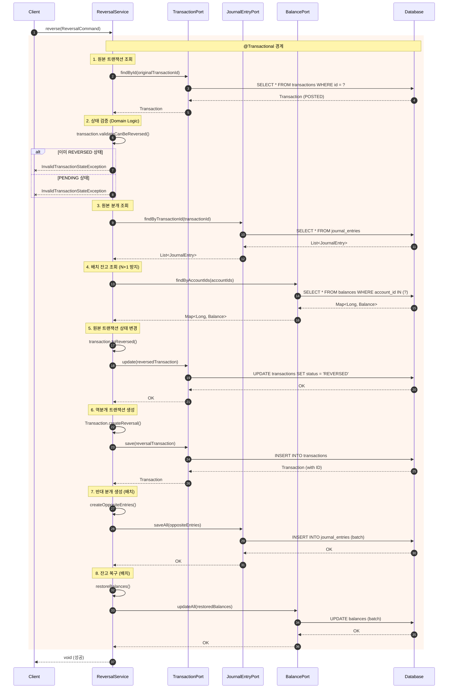
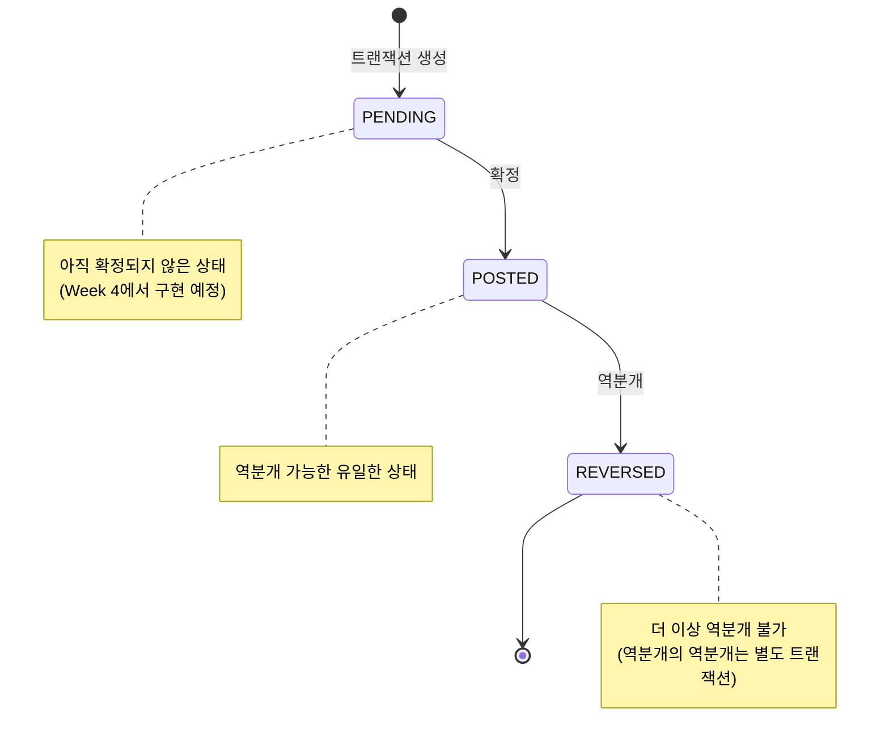
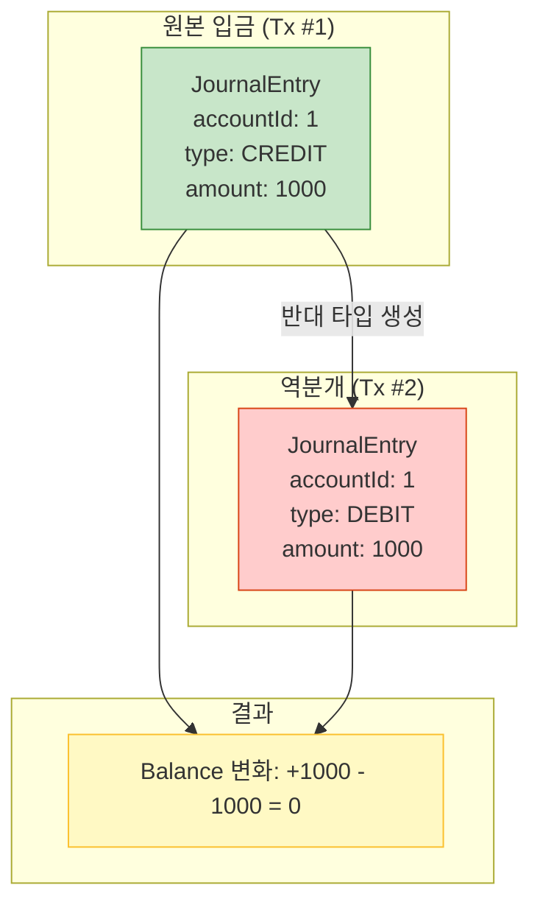

# 역분개 (Reversal) 플로우 다이어그램

> 금융 시스템에서 잘못된 거래를 취소하는 **역분개(Reversal)** 패턴을 설명합니다.

---

## 역분개란?

금융 원장에서는 한 번 기록된 거래를 **절대 삭제하거나 수정하지 않습니다**.  
대신, **반대 방향의 거래를 새로 만들어서 상쇄**합니다.

---

## 역분개 Sequence Diagram

---

## 상태 전이 다이어그램

---

## 분개 상쇄 (JournalEntry Reversal)

---

## 핵심 설계 원칙

| 원칙 | 설명 |
|------|------|
| **불변성** | 원본 트랜잭션의 **금액, 타입, businessRefId 등 핵심 데이터**는 절대 수정하지 않음. **상태(status)만** `POSTED` → `REVERSED`로 전이. |
| **추적성** | `reversalOfTransactionId`로 원본-역분개 연결 |
| **도메인 로직** | 검증 로직은 `Transaction.validateCanBeReversed()`에 위치 |
| **배치 처리** | N+1 쿼리 방지를 위해 `findByAccountIds`, `saveAll`, `updateAll` 사용 |
