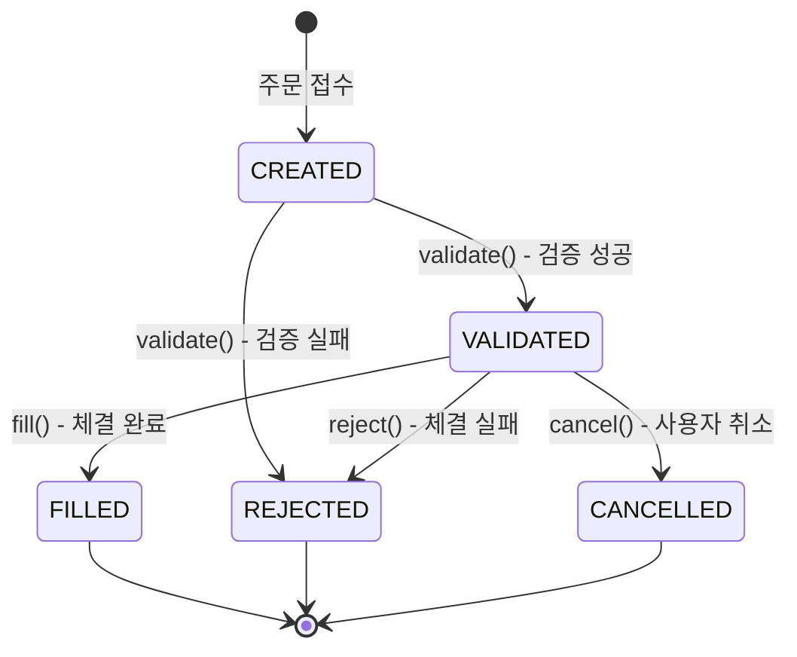

# Week 5: 주문 상태 머신(State Machine) 설계 + API 레이어

## 목표
주문 시스템의 핵심 도메인을 설계하고, 상태 패턴(State Pattern)을 적용하여 주문 생명주기를 관리한다. 
REST API 레이어를 구현하고 OpenAPI(Swagger) 문서화를 통해 API 명세를 제공한다.

---

## PR 1: 주문 도메인 모델링 및 상태 머신 설계 (~200 LOC)

> **목표.md 반영**: 주문 생명주기 관리, 상태 패턴(State Pattern) 적용

### TDD Cycle (Order 엔티티)
- [x] **RED**: Order 생성 테스트 작성
  - Given: 유효한 주문 정보 (accountId, symbol, quantity, side)
  - When: Order.create() 호출
  - Then: CREATED 상태로 생성됨
- [x] **GREEN**: Order 엔티티 및 초기 상태 구현
- [x] **REFACTOR**: 빌더 패턴 또는 정적 팩토리 메서드 적용

### TDD Cycle (상태 전이)
- [x] **RED**: CREATED → VALIDATED 전환 테스트
- [x] **GREEN**: validate() 메서드 구현
- [x] **REFACTOR**: 상태 전이 로직 캡슐화

- [x] **RED**: VALIDATED → FILLED 전환 테스트
- [x] **GREEN**: fill() 메서드 구현

- [x] **RED**: VALIDATED → REJECTED 전환 테스트
- [x] **GREEN**: reject() 메서드 구현

- [x] **RED**: VALIDATED → CANCELLED 전환 테스트
- [x] **GREEN**: cancel() 메서드 구현

### 구현 항목
- [x] `Order` 엔티티 설계
  - id, accountId, symbol, quantity, side, price, orderType
  - status, rejectedReason, createdAt, updatedAt
  - businessRefId (주문 추적용 비즈니스 참조 ID)
    > ⚠️ **멱등성 처리(Idempotency-Key)는 Week 8에서 별도 구현** - `businessRefId`는 클라이언트가 제공하는 주문 추적 ID, `Idempotency-Key`는 HTTP 헤더 기반 재시도 방지 키로 역할이 다름
  - executedPrice, executedQuantity (nullable, Week 7 체결 정보 저장용)
- [x] `OrderStatus` enum 정의
  - CREATED: 주문 생성됨
  - VALIDATED: 검증 완료 (예수금 확보, 규칙 통과)
  - FILLED: 체결 완료
  - REJECTED: 거부됨 (사유 포함)
  - CANCELLED: 사용자에 의해 취소됨
  > ⚠️ **부분 체결(PARTIALLY_FILLED)은 Week 7에서 확장** - 슬리피지 방어 및 잔량 취소 정책과 함께 구현 예정 (YAGNI 원칙)
- [x] `OrderSide` enum 정의 (BUY, SELL)
- [x] `OrderType` enum 정의 (MARKET - Week 5에서는 시장가만 지원)
- [x] `RejectionReason` 정의
  - INSUFFICIENT_BALANCE: 예수금 부족
  - INSUFFICIENT_QUANTITY: 보유 수량 부족
  - MARKET_CLOSED: 장 마감
  - PRICE_SLIPPAGE: 슬리피지 초과 (Week 7)

### 상태 전이 규칙



### 문서화
- [x] **[Diagram]** 주문 상태 머신 다이어그램 (`/docs/diagrams/order-state-machine.md`)
- [x] **[ADR]** 상태 머신 설계 패턴 결정 (`/docs/adr/010-order-state-machine-pattern.md`)
  - State Pattern vs Enum + Domain Method 비교
  - YAGNI 원칙에 따른 Enum 방식 선택 근거
  - Week 7 확장 시 리팩토링 전략

- [x] PR 생성 및 머지

---

## PR 2: 주문 Validation 로직 구현 (~250 LOC)

> **목표.md 반영**: 예수금 부족, 보유 수량 부족 시 REJECT, 장 운영 시간 위반 시 REJECT

### TDD Cycle (예수금 검증)
- [x] **RED**: 매수 시 예수금 부족 테스트
  - Given: 잔액 10,000원, 주문 금액 50,000원
  - When: validate() 호출
  - Then: REJECTED (INSUFFICIENT_BALANCE)
- [x] **GREEN**: 예수금 검증 로직 구현
- [x] **REFACTOR**: 검증 로직 분리 (OrderValidator)

### TDD Cycle (보유 수량 검증)
- [x] **RED**: 매도 시 보유 수량 부족 테스트
  - Given: 보유 수량 5주, 매도 주문 10주
  - When: validate() 호출
  - Then: REJECTED (INSUFFICIENT_QUANTITY)
- [x] **GREEN**: 보유 수량 검증 로직 구현
- [x] **REFACTOR**: Ledger 연동 추상화 (Port 정의)

### TDD Cycle (장 운영 시간 검증)
- [x] **RED**: 장 마감 시간 주문 테스트
  - Given: 현재 시간 18:00 (장 마감 후)
  - When: validate() 호출
  - Then: REJECTED (MARKET_CLOSED)
- [x] **GREEN**: 장 운영 시간 검증 로직 구현
- [x] **REFACTOR**: 시간 관련 로직 Clock 주입 (테스트 용이성)

### 구현 항목
- [x] `OrderValidator` 컴포넌트 생성
  - validateBalance(Order order): 예수금 검증
  - validateQuantity(Order order): 보유 수량 검증
  - validateMarketHours(Order order): 장 운영 시간 검증
- [x] `MarketHoursPolicy` 설계
  - 장 시작: 09:00, 장 마감: 15:30 (KST 기준)
  - 휴장일 처리 (선택적, Week 11 버퍼에서 확장 가능)
- [x] Ledger 서비스 연동 Port 정의
  - `BalanceQueryPort`: 잔액 조회
  - `PositionQueryPort`: 보유 수량 조회 (Week 9와 연계)
  > ⚠️ **Week 5에서는 Mock 구현체 사용** - 실제 Ledger 연동은 Week 7에서 `Trade → Ledger → Position` 플로우와 함께 구현. Week 5에서는 `MockBalanceQueryAdapter`, `MockPositionQueryAdapter`로 테스트 가능하도록 구성

### Hexagonal Architecture 확장

```
kuku-order-system/src/main/java/com/securities/kuku/order/
├── domain/                            ← PR 1 완료
│   ├── Order.java
│   ├── OrderStatus.java
│   ├── OrderSide.java
│   ├── OrderType.java
│   ├── RejectionReason.java
│   └── InvalidOrderStateException.java
├── application/
│   ├── port/
│   │   └── out/                       ← PR 2 완료
│   │       ├── BalanceQueryPort.java
│   │       └── PositionQueryPort.java
│   └── validation/                    ← PR 2 완료
│       ├── OrderValidator.java
│       └── MarketHoursPolicy.java
├── adapter/
│   └── out/
│       └── mock/                      ← PR 2 완료 (Week 5 임시)
│           ├── MockBalanceQueryAdapter.java
│           └── MockPositionQueryAdapter.java
└── config/
    └── ClockConfig.java               ← PR 2 완료
```

> [!NOTE]
> `application/port/in/`, `application/service/`, `adapter/in/web/`는 PR 3에서 구현 예정

- [ ] PR 생성 및 머지

---

## PR 3: OrderController REST API 구현 (~200 LOC)

> **목표.md 반영**: OrderController 구현 - 주문 생성, 조회, 취소 API

### TDD Cycle (주문 생성 API)
- [x] **RED**: `POST /api/v1/orders` 성공 테스트
  - Given: 유효한 주문 요청
  - When: API 호출
  - Then: 201 Created, 주문 ID 반환
- [x] **GREEN**: OrderController.placeOrder() 구현
- [x] **REFACTOR**: DTO 분리 (Request, Response)

### TDD Cycle (주문 조회 API)
- [x] **RED**: `GET /api/v1/orders/{orderId}` 성공 테스트
- [x] **GREEN**: OrderController.getOrder() 구현
- [x] **REFACTOR**: 없는 주문 조회 시 404 응답 처리

### TDD Cycle (GetOrderService)
- [x] **RED**: 존재하는 주문 조회 테스트
  - Given: 저장된 주문
  - When: getOrder(orderId) 호출
  - Then: 주문 정보 반환
- [x] **GREEN**: GetOrderService 구현
- [x] **REFACTOR**: Optional 처리 및 예외 변환 (OrderNotFoundException)

### TDD Cycle (주문 취소 API)
- [x] **RED**: `POST /api/v1/orders/{orderId}/cancel` 성공 테스트
- [x] **GREEN**: OrderController.cancelOrder() 구현
- [x] **REFACTOR**: 취소 불가 상태 처리 (FILLED, REJECTED, CANCELLED)

### 구현 항목
- [x] `OrderController` 생성
  - `POST /api/v1/orders` - 주문 생성
  - `GET /api/v1/orders/{orderId}` - 주문 조회
  - `POST /api/v1/orders/{orderId}/cancel` - 주문 취소
- [x] Request/Response DTO 정의
  - `PlaceOrderRequest`: symbol, quantity, side, orderType, price(optional)
  - `OrderResponse`: orderId, status, createdAt, ...
- [x] 에러 응답 표준화
  - 400 Bad Request: 잘못된 요청 형식
  - 404 Not Found: 주문 없음
  - 409 Conflict: 취소 불가 상태
  - 422 Unprocessable Entity: Validation 실패 (예수금 부족 등)

### Hexagonal Architecture 확장

```
kuku-order-system/src/main/java/com/securities/kuku/order/
├── adapter/
│   └── in/
│       └── web/
│           ├── OrderController.java
│           ├── dto/
│           │   ├── PlaceOrderRequest.java
│           │   ├── OrderResponse.java
│           │   └── ErrorResponse.java
│           └── GlobalExceptionHandler.java
```

- [ ] PR 생성 및 머지

---

## PR 4: OpenAPI(Swagger) Spec 문서화 (~100 LOC)

> **목표.md 반영**: OpenAPI(Swagger) Spec 문서화 (`springdoc-openapi`)

### 구현 항목
- [ ] `springdoc-openapi-starter-webmvc-ui` 의존성 추가
- [ ] Swagger UI 설정 (`/swagger-ui.html`)
- [ ] API 메타데이터 설정
  - 제목: Kuku Order System API
  - 버전: v1
  - 설명: 주문 생성, 조회, 취소 API
- [ ] Controller에 OpenAPI 어노테이션 추가
  - `@Operation`: API 설명
  - `@ApiResponse`: 응답 코드별 설명
  - `@Parameter`: 파라미터 설명

### 문서화
- [ ] Swagger UI 접속 확인 (`http://localhost:8082/swagger-ui.html`)
- [ ] API 명세서 스크린샷 또는 링크 README 추가

- [ ] PR 생성 및 머지

---

## PR 5: 주문 영속성 어댑터 구현 (~200 LOC)

> **목표.md 반영**: JPA 기반 주문 데이터 영속화

### TDD Cycle
- [ ] **RED**: 주문 저장 및 조회 테스트
- [ ] **GREEN**: OrderPersistenceAdapter 구현
- [ ] **REFACTOR**: Entity-Domain 매핑 분리

### 구현 항목
- [ ] `OrderEntity` JPA 엔티티 생성
- [ ] `OrderJpaRepository` 인터페이스 생성
- [ ] `OrderPersistenceAdapter` 구현 (OrderPort 구현체)
- [ ] `schema.sql` 업데이트 (orders 테이블)

### 데이터베이스 스키마

```sql
CREATE TABLE orders (
    id BIGINT PRIMARY KEY,
    account_id BIGINT NOT NULL,
    symbol VARCHAR(20) NOT NULL,
    quantity DECIMAL(18, 8) NOT NULL,
    side VARCHAR(10) NOT NULL,
    order_type VARCHAR(10) NOT NULL,
    price DECIMAL(18, 8),
    status VARCHAR(20) NOT NULL,
    rejected_reason VARCHAR(50),
    business_ref_id VARCHAR(100) UNIQUE,
    -- Week 7 체결 정보 저장용 (nullable)
    executed_price DECIMAL(18, 8),
    executed_quantity DECIMAL(18, 8),
    created_at TIMESTAMP NOT NULL,
    updated_at TIMESTAMP NOT NULL,
    
    INDEX idx_orders_account_id (account_id),
    INDEX idx_orders_status (status),
    INDEX idx_orders_created_at (created_at)
);
```

### Hexagonal Architecture 확장

```
kuku-order-system/src/main/java/com/securities/kuku/order/
├── adapter/
│   └── out/
│       └── persistence/
│           ├── OrderEntity.java
│           ├── OrderJpaRepository.java
│           └── OrderPersistenceAdapter.java
```

- [ ] PR 생성 및 머지

---

## PR 6: API Sequence Diagram 및 문서화 (~50 LOC)

> **목표.md 반영**: 주문 API Sequence Diagram 작성

### 다이어그램 작성
- [ ] **[Diagram]** 주문 API Sequence Diagram (`/docs/diagrams/order-api-sequence.md`)
  - 주문 생성 (성공 케이스)
  - 주문 생성 (검증 실패 케이스)
  - 주문 취소

### 문서 정리
- [ ] kuku-order-system/README.md 작성
  - 모듈 개요
  - 도메인 모델 설명
  - API 명세 링크

### 회고
- [ ] Week 5 회고 작성 (`/docs/retrospectives/week-05.md`)
  - 🎯 이번 주 목표 달성도
  - ✅ 잘한 점 (Keep)
  - 🔧 개선할 점 (Problem)
  - 💡 시도해볼 것 (Try)
  - 📝 배운 점 / 기술 인사이트

- [ ] PR 생성 및 머지

---

## PR 7: 예외 패키지 구조 개선 및 ErrorResponse 리팩토링 (~150 LOC)

> **추가 개선 사항**: 코드 품질 및 테스트 가능성 향상

### 구현 항목

#### 1. 예외 클래스 패키지 분리
- [x] Order 모듈: `domain/exception/` 서브패키지 생성
  - `OrderErrorCode.java`
  - `OrderNotFoundException.java`
  - `InvalidOrderStateException.java`
  - `InvalidOrderSideException.java`
  - `InvalidOrderTypeException.java`
  - `OrderLimitExceededException.java`
  - `OrderValidationException.java`
- [x] Ledger 모듈: `domain/exception/` 서브패키지 생성
  - `LedgerErrorCode.java`
  - `InsufficientBalanceException.java`
  - `InvalidTransactionStateException.java`

#### 2. ErrorResponse Static Clock 안티패턴 제거
- [x] `ErrorResponse`에서 `static Clock` 및 `setClock()`/`resetClock()` 제거
- [x] 모든 팩토리 메서드가 `Instant timestamp`를 필수 파라미터로 받도록 변경
- [x] `OrderExceptionHandler`에 `Clock` DI 추가
- [x] 테스트 격리성 및 병렬 테스트 안전성 확보

#### 3. 테스트 코드 품질 개선
- [x] 매직 스트링 제거: `"ORDER_001"` → `ORDER_NOT_FOUND.getCode()`
- [x] `OrderErrorCode`, `CommonErrorCode` static import 적용
- [x] 미사용 코드 제거 (`FIXED_CLOCK`, `ZoneId` import)

### 아키텍처 결정 근거

| 관점 | Before | After |
|------|--------|-------|
| **테스트 격리** | Static state 공유 ❌ | DI 기반 독립 실행 ✅ |
| **병렬 테스트** | Race condition 가능 ❌ | 안전 ✅ |
| **SRP** | DTO가 시간 책임 ❌ | Handler 책임 ✅ |
| **일관성** | 서비스와 패턴 불일치 ❌ | Clock DI 패턴 통일 ✅ |

- [x] PR 생성 및 머지

---

## Hexagonal Architecture 패키지 구조 (Week 5 최종)

> 실제 구현된 구조 (Week 5 완료 시점)

```
kuku-order-system/src/main/java/com/securities/kuku/order/
├── OrderApplication.java
├── domain/
│   ├── Order.java
│   ├── OrderStatus.java
│   ├── OrderSide.java
│   ├── OrderType.java
│   └── RejectionReason.java
├── application/
│   ├── port/
│   │   ├── in/
│   │   │   ├── PlaceOrderUseCase.java
│   │   │   ├── CancelOrderUseCase.java
│   │   │   ├── GetOrderUseCase.java
│   │   │   └── command/
│   │   │       ├── PlaceOrderCommand.java
│   │   │       └── CancelOrderCommand.java
│   │   └── out/
│   │       ├── OrderPort.java
│   │       ├── BalanceQueryPort.java
│   │       └── PositionQueryPort.java
│   ├── service/
│   │   ├── PlaceOrderService.java
│   │   ├── CancelOrderService.java
│   │   └── GetOrderService.java
│   └── validation/
│       ├── OrderValidator.java
│       └── MarketHoursPolicy.java
├── adapter/
│   ├── in/
│   │   └── web/
│   │       ├── OrderController.java
│   │       ├── dto/
│   │       │   ├── PlaceOrderRequest.java
│   │       │   ├── OrderResponse.java
│   │       │   └── ErrorResponse.java
│   │       └── GlobalExceptionHandler.java
│   └── out/
│       └── persistence/
│           ├── OrderEntity.java
│           ├── OrderJpaRepository.java
│           └── OrderPersistenceAdapter.java
└── config/
    ├── ClockConfig.java
    └── SwaggerConfig.java
```

> [!NOTE]
> **Week 6 구현 예정**: 동시성 제어 (Optimistic Lock, Redis Distributed Lock), 극한 테스트
> **Week 7 구현 예정**: Matching Engine 연동, Kafka 이벤트 발행

---

## 테스트 파일 구조 (Week 5 최종)

```
kuku-order-system/src/test/java/com/securities/kuku/order/
├── domain/
│   ├── OrderTest.java
│   ├── OrderStatusTest.java
│   └── OrderSideTest.java
├── application/
│   ├── service/
│   │   ├── PlaceOrderServiceTest.java
│   │   └── CancelOrderServiceTest.java
│   └── validation/
│       ├── OrderValidatorTest.java
│       └── MarketHoursPolicyTest.java
├── adapter/
│   ├── in/web/
│   │   └── OrderControllerTest.java
│   └── out/persistence/
│       └── OrderPersistenceAdapterTest.java
└── integration/
    └── OrderIntegrationTest.java
```

---

## 주요 기술 결정 사항

### 1. 상태 패턴 vs Enum 기반 상태 전이

| 선택지 | 장점 | 단점 |
|--------|------|------|
| **State Pattern** | OCP 준수, 상태별 로직 분리 | 클래스 수 증가, 복잡도 상승 |
| **Enum + Domain Method** | 단순, 코드량 적음 | 상태 추가 시 switch 문 수정 필요 |

> **결정**: Week 5에서는 **Enum + Domain Method** 방식으로 시작. 상태가 더 복잡해지면 State Pattern으로 리팩토링 고려 (YAGNI 원칙)

### 2. 장 운영 시간 정책

| 항목 | 값 | 비고 |
|------|-----|------|
| 장 시작 | 09:00 KST | |
| 장 마감 | 15:30 KST | |
| 휴장일 | Week 11 버퍼에서 확장 | 공휴일 API 연동 등 |
| 시간대 | Asia/Seoul | ZoneId 설정 |

### 3. API 에러 응답 표준

| HTTP 상태 코드 | 사용 상황 |
|----------------|----------|
| 201 Created | 주문 생성 성공 |
| 200 OK | 조회 성공 |
| 204 No Content | 취소 성공 |
| 400 Bad Request | 요청 형식 오류 |
| 404 Not Found | 주문 없음 |
| 409 Conflict | 상태 충돌 (이미 취소됨 등) |
| 422 Unprocessable Entity | 비즈니스 규칙 위반 (예수금 부족 등) |

---

## Week 6 Preview

Week 5 완료 후 동시성 제어 전략 구현으로 넘어갑니다:

- [ ] Optimistic Lock vs Pessimistic Lock vs Redis Distributed Lock 비교
- [ ] 극한 동시성 테스트 (1000명 동시 100만원 매수)
- [ ] DB Lock 경쟁 시나리오 테스트
- [ ] 장애 주입 테스트 (Redis 장애, Connection Pool 고갈)

---

## 미래 개선 사항 (Future Enhancements)

### 거부 주문 처리 개선: 도메인 이벤트 기반 접근

> [!NOTE]
> **현재 상태**: 검증 실패 시 `OrderValidationException` 발생, 거부 주문 미저장
> **목표 상태**: 모든 주문(성공/거부)을 저장하고, 도메인 이벤트로 후속 처리

#### 배경 및 필요성

1. **규제 준수 (Compliance)**: 금감원 검사 시 거부된 주문에 대한 증빙 필요
2. **고객 민원 대응**: "왜 내 주문이 거부되었나요?" 히스토리 조회
3. **패턴 분석**: 반복적인 잔액 부족 주문 → UX/마케팅 인사이트

#### 구현 계획 (Week 7 Kafka 이벤트 발행과 연계)

##### Phase 1: 거부 주문 저장 (Week 5 후속)

```java
// PlaceOrderService.java - 예외 대신 상태 기반 처리
public Order placeOrder(PlaceOrderCommand command) {
    Order order = Order.create(...);
    Optional<RejectionReason> reason = orderValidator.validate(order);
    
    Order finalOrder = reason
        .map(r -> order.reject(r, now))   // REJECTED 상태
        .orElseGet(() -> order.validate(now));  // VALIDATED 상태
    
    return orderPort.save(finalOrder);  // 항상 저장
}
```

##### Phase 2: 도메인 이벤트 발행 (Week 7)

```java
// Order.java - 도메인 이벤트 생성
public Order reject(RejectionReason reason, Instant now) {
    // 상태 전이 후 도메인 이벤트 등록
    Order rejected = this.withStatus(OrderStatus.REJECTED, reason, now);
    rejected.registerEvent(OrderRejectedEvent.of(this.id, reason, now));
    return rejected;
}

// PlaceOrderService.java - 이벤트 발행
Order savedOrder = orderPort.save(finalOrder);
eventPublisher.publish(savedOrder.domainEvents());
return savedOrder;
```

##### Phase 3: 이벤트 핸들러 (Week 7)

```java
@EventListener
public class OrderAuditEventHandler {
    
    @TransactionalEventListener(phase = AFTER_COMMIT)
    public void handleOrderRejected(OrderRejectedEvent event) {
        // 감사 로그 저장
        auditLogPort.save(AuditLog.fromRejection(event));
        
        // 알림 발송 (선택적)
        if (event.reason() == RejectionReason.INSUFFICIENT_BALANCE) {
            notificationPort.sendBalanceAlert(event.accountId());
        }
    }
}
```

#### 연관 작업

- [ ] `OrderStatus.isSuccessful()` 메서드 추가 (VALIDATED, FILLED → true)
- [ ] `OrderRejectedEvent`, `OrderValidatedEvent` 도메인 이벤트 정의
- [ ] Controller HTTP 상태 코드 결정 로직 개선
- [ ] Outbox 패턴 적용 (Kafka 메시지 발행 보장)

#### ADR 참조

- [ADR-008: Outbox Pattern](file:///docs/adr/008-outbox-pattern.md) - 도메인 이벤트 발행 패턴
