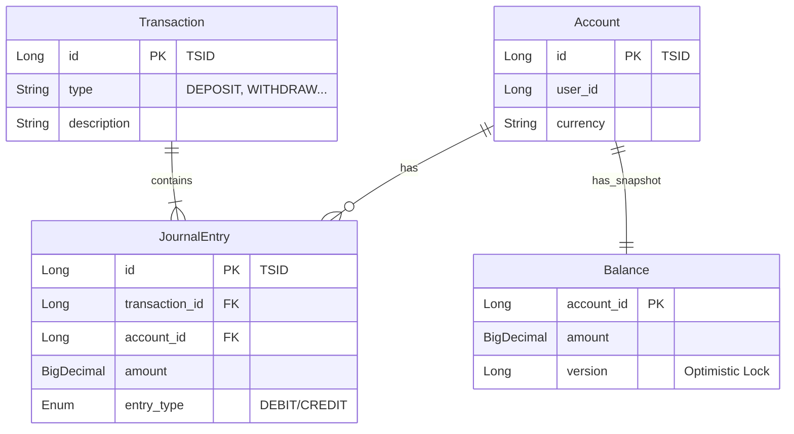

# Core Ledger Domain Model

이 모듈은 금융 시스템의 핵심인 **원장(Ledger)**을 담당합니다.
데이터의 무결성(Integrity)과 추적 가능성(Traceability)을 보장하기 위해 **이중 부기(Double-Entry Bookkeeping)** 원칙을 따릅니다.

## 🏗 Domain Entities (Why & Role)

왜 `Account`, `Transaction`, `JournalEntry`, `Balance`라는 4가지 도메인을 정의했을까요?

### 1. Account (계좌)
*   **Role**: 자산(Asset)이 담기는 **그릇(Container)**입니다.
*   **Why**: "누구의 돈인가?" 또는 "어떤 목적의 자금인가?"를 식별해야 합니다.
*   **Attributes**: `userId` (소유자), `currency` (통화), `accountNumber` (식별자).

### 2. JournalEntry (분개)
*   **Role**: 자산의 **이동(Movement)**을 기록하는 최소 단위입니다.
*   **Why**: **"돈은 사라지거나 갑자기 생겨나지 않는다"**는 원칙을 지키기 위함입니다.
    *   모든 변동은 **차변(Debit)**과 **대변(Credit)**으로 나뉘어 기록됩니다.
    *   하나의 거래 안에서 `Sum(Debit) - Sum(Credit) = 0`이 항상 성립해야 합니다.
*   **Source of Truth**: 시스템의 모든 진실은 이 `JournalEntry`들의 합에 있습니다.

### 3. Transaction (거래)
*   **Role**: 여러 개의 `JournalEntry`를 하나로 묶는 **논리적 사건(Logical Event)**입니다.
*   **Why**: "무슨 일이 일어났는가?"(Context)를 남기기 위함입니다.
    *   단순히 `A계좌 +100원`, `B계좌 -100원`만 있으면 이것이 "입금"인지 "이체"인지 "정산"인지 알기 어렵습니다.
    *   `Transaction`은 `Deposit`, `Withdraw`, `BuyOrder` 등의 타입과 설명을 통해 **감사(Audit)**를 가능하게 합니다.

### 4. Balance (잔고)
*   **Role**: 특정 시점의 계좌 **상태(Snapshot)**입니다.
*   **Why**: **성능(Performance)** 때문입니다.
    *   원칙적으로 잔고는 "태초부터 지금까지의 모든 `JournalEntry`의 합"입니다.
    *   하지만 매번 수억 건의 데이터를 더할 수 없으므로, 현재 잔액을 미리 계산하여 저장해 둡니다.
    *   **Note**: `Balance`는 편의를 위한 캐시 성격이며, 데이터 불일치 시 `JournalEntry`를 다시 집계하여 복구할 수 있어야 합니다.

---

## 📊 Entity Relationship

