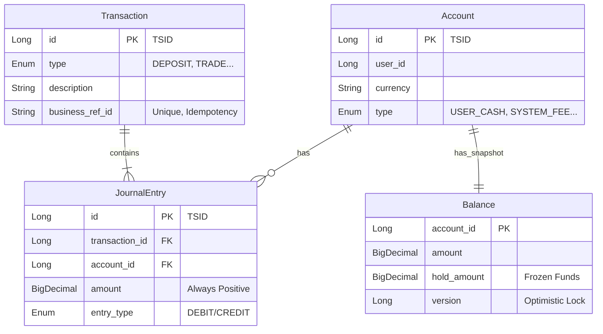

# Core Ledger Domain Model

이 모듈은 금융 시스템의 핵심인 **원장(Ledger)**을 담당합니다.
데이터의 무결성(Integrity)과 추적 가능성(Traceability)을 보장하기 위해 **이중 부기(Double-Entry Bookkeeping)** 원칙을 따릅니다.

## 🏗 Domain Entities (Why & Role)

왜 `Account`, `Transaction`, `JournalEntry`, `Balance`라는 4가지 도메인을 정의했을까요?

### 1. Account (계좌)
*   **Role**: 자산(Asset)이 담기는 **그릇(Container)**입니다.
*   **Why**: "누구의 돈인가?" 또는 "어떤 목적의 자금인가?"를 식별해야 합니다.
*   **Attributes**:
    *   `userId`: 소유자 ID
    *   `currency`: 통화 (KRW, USD 등)
    *   `accountNumber`: 계좌 번호 (식별자)
    *   `type`: 계좌 성격 (`USER_CASH`, `USER_SECURITIES`, `SYSTEM_FEE` 등)

### 2. JournalEntry (분개)
*   **Role**: 자산의 **이동(Movement)**을 기록하는 최소 단위입니다.
*   **Why**: **"돈은 사라지거나 갑자기 생겨나지 않는다"**는 원칙을 지키기 위함입니다.
    *   모든 변동은 **차변(Debit)**과 **대변(Credit)**으로 나뉘어 기록됩니다.
    *   하나의 거래 안에서 `Sum(Debit) - Sum(Credit) = 0`이 항상 성립해야 합니다.
    *   **Validation**: `amount`는 항상 **양수(+)**로 저장하며, 부호는 `entry_type`(`DEBIT`/`CREDIT`)으로 결정합니다.
*   **Source of Truth**: 시스템의 모든 진실은 이 `JournalEntry`들의 합에 있습니다.

### 3. Transaction (거래)
*   **Role**: 여러 개의 `JournalEntry`를 하나로 묶는 **논리적 사건(Logical Event)**입니다.
*   **Why**: "무슨 일이 일어났는가?"(Context)를 남기기 위함입니다.
    *   단순히 `A계좌 +100원`, `B계좌 -100원`만 있으면 이것이 "입금"인지 "이체"인지 "정산"인지 알기 어렵습니다.
    *   `Transaction`은 `businessRefId`(예: 주문 ID)에 유니크 제약조건을 걸어, **네트워크 지연 등으로 인한 중복 결제 요청을 DB 레벨에서 방어(멱등성 보장)**하고, `type`을 통해 감사와 추적을 가능하게 합니다.
*   **TransactionStatus** (트랜잭션 상태):
    *   `PENDING`: 생성되었으나 아직 확정되지 않음
    *   `POSTED`: 확정되어 잔액에 반영됨
    *   `REVERSED`: 역분개되어 무효화됨

#### 역분개(Reversal)란?

금융 시스템에서 **"실수를 지우개로 지우지 않는다"**는 원칙이 있습니다.

일반적인 프로그래밍에서는 잘못된 데이터를 `DELETE`하거나 `UPDATE`로 수정하지만,
**금융 원장에서는 한 번 기록된 거래를 절대 삭제하거나 수정하지 않습니다.**
대신, **반대 방향의 거래를 새로 만들어서 상쇄**합니다. 이것이 바로 **역분개(Reversal)**입니다.

**왜 이렇게 할까요?**
*   **감사 추적(Audit Trail)**: 모든 변경 이력이 남아야 규제 기관의 감사에 대응할 수 있습니다.
*   **데이터 무결성**: 중간에 데이터가 사라지면 "잔액의 합 = 분개의 합" 공식이 깨집니다.
*   **복구 가능성**: 역분개도 되돌릴 수 있습니다(역분개의 역분개).

**예시: 잘못된 입금 취소**

| 순서 | Transaction ID | Type | Status | 설명 |
|------|----------------|------|--------|------|
### 3. 역분개 (Reversal) 패턴
잘못된 트랜잭션을 취소할 때는 데이터를 삭제하거나 수정하지 않고, **역분개 트랜잭션(Reversal Transaction)**을 생성하여 상쇄합니다.

*   **원본 트랜잭션**: `status`가 `POSTED` -> `REVERSED`로 변경됩니다 (Copy-on-Write).
*   **역분개 트랜잭션**:
    *   `reversalOfTransactionId`에 원본 트랜잭션 ID를 기록합니다.
    *   `type`은 원본 트랜잭션과 **동일하게 유지**합니다 (예: 입금 취소 시에도 `DEPOSIT`).
    *   `JournalEntry`는 원본과 반대로 기록되어 잔액을 원복시킵니다.

```mermaid
graph LR
    T1[Tx #1: 입금 100원<br>(POSTED -> REVERSED)] -->|취소| T2[Tx #2: 입금 역분개 100원<br>(POSTED)]
    T2 -->|reversalOf| T1
```
| 1 | 100 | DEPOSIT | ~~POSTED~~ → **REVERSED** | 1,000원 입금 (실수!) |
| 2 | 101 | DEPOSIT | POSTED | 역분개: 1,000원 (원본과 동일 금액, JournalEntry가 반대 방향으로 기록되어 상쇄) |

> **Note**: 역분개 트랜잭션의 `Type`은 원본 트랜잭션과 동일하게 유지합니다(예: `DEPOSIT`). 이는 "입금 행위에 대한 취소"임을 명확히 하기 위함이며, 실질적인 잔액 차감은 `JournalEntry`의 차변/대변이 반대로 기록됨으로써 처리됩니다.

*   거래 #100은 삭제되지 않고 `REVERSED` 상태로 남습니다.
*   거래 #101이 반대 분개를 수행하여 잔액을 원복합니다.
*   `reversalOfTransactionId`로 두 거래가 연결되어 추적 가능합니다.

### 4. Balance (잔고)
*   **Role**: 특정 시점의 계좌 **상태(Snapshot)**입니다.
*   **Why**: **성능(Performance)** 때문입니다.
    *   원칙적으로 잔고는 "태초부터 지금까지의 모든 `JournalEntry`의 합"입니다.
    *   하지만 매번 수억 건의 데이터를 더할 수 없으므로, 현재 잔액을 미리 계산하여 저장해 둡니다.
    *   **Concurrency**: JPA의 `@Version`을 이용한 **낙관적 락(Optimistic Lock)**을 사용하여, 잔고 갱신 시 Race Condition을 방어합니다.
    *   **Available Balance**: 주문 시점과 정산 시점의 차이를 위해 `hold_amount`(동결 금액)를 관리합니다.
        *   `Available Balance = Balance - Hold Amount`

---

## 📊 Entity Relationship


