# Core Ledger Domain Model

이 모듈은 금융 시스템의 핵심인 **원장(Ledger)**을 담당합니다.
데이터의 무결성(Integrity)과 추적 가능성(Traceability)을 보장하기 위해 **이중 부기(Double-Entry Bookkeeping)** 원칙을 따릅니다.

## 🏛 System Architecture

### Asset Hold (자산 동결) - Synchronous or Strong Consistency

주문이 매칭 엔진으로 넘어가기 전, 원장(Ledger)에서 해당 자산(매수 시 현금, 매도 시 주식)을 **동결(Hold)**해야 합니다.

이 과정은 엄격한 정합성이 필요하므로, 주문 시스템이 원장 서비스를 동기적(혹은 높은 신뢰성의 비동기 패턴)으로 호출하여 잔고 부족 시 주문을 즉시 거부(Reject)합니다.

### Settlement (정산) - Event Driven

체결(Trade)은 돌이킬 수 없는 사실입니다. Kafka를 통해 이벤트를 발행하고, 원장 서비스는 이를 구독하여 **최종적 일관성(Eventual Consistency)**을 가지고 실제 자산을 차감/지급합니다.

## 🏗 Domain Entities (Why & Role)

왜 `Account`, `Transaction`, `JournalEntry`, `Balance`라는 4가지 도메인을 정의했을까요?

### 1. Account (계좌)
*   **Role**: 자산(Asset)이 담기는 **그릇(Container)**입니다.
*   **Why**: "누구의 돈인가?" 또는 "어떤 목적의 자금인가?"를 식별해야 합니다.
*   **Attributes**:
    *   `userId`: 소유자 ID
    *   `currency`: 통화 (KRW, USD 등)
    *   `accountNumber`: 계좌 번호 (식별자)
    *   `type`: 계좌 성격 (`USER_CASH`, `USER_SECURITIES`, `SYSTEM_FEE` 등)

### 2. JournalEntry (분개)
*   **Role**: 자산의 **이동(Movement)**을 기록하는 최소 단위입니다.
*   **Why**: **"돈은 사라지거나 갑자기 생겨나지 않는다"**는 원칙을 지키기 위함입니다.
    *   모든 변동은 **차변(Debit)**과 **대변(Credit)**으로 나뉘어 기록됩니다.
    *   하나의 거래 안에서 `Sum(Debit) - Sum(Credit) = 0`이 항상 성립해야 합니다.
    *   **Validation**: `amount`는 항상 **양수(+)**로 저장하며, 부호는 `entry_type`(`DEBIT`/`CREDIT`)으로 결정합니다.
*   **Source of Truth**: 시스템의 모든 진실은 이 `JournalEntry`들의 합에 있습니다.

### 3. Transaction (거래)
*   **Role**: 여러 개의 `JournalEntry`를 하나로 묶는 **논리적 사건(Logical Event)**입니다.
*   **Why**: "무슨 일이 일어났는가?"(Context)를 남기기 위함입니다.
    *   단순히 `A계좌 +100원`, `B계좌 -100원`만 있으면 이것이 "입금"인지 "이체"인지 "정산"인지 알기 어렵습니다.
    *   `Transaction`은 `businessRefId`(예: 주문 ID)에 유니크 제약조건을 걸어, **네트워크 지연 등으로 인한 중복 결제 요청을 DB 레벨에서 방어(멱등성 보장)**하고, `type`을 통해 감사와 추적을 가능하게 합니다.
*   **TransactionStatus** (트랜잭션 상태):
    *   `PENDING`: 생성되었으나 아직 확정되지 않음
    *   `POSTED`: 확정되어 잔액에 반영됨
    *   `REVERSED`: 역분개되어 무효화됨
    *   `UNKNOWN`: 외부 시스템 Timeout, DB 커넥션 실패 등으로 상태 확인이 필요함

> **Note**: `UNKNOWN` 상태는 불확실한 상황에서 트랜잭션을 임시로 표시하며, 수동으로 확인 후 `POSTED`로 해결해야 합니다. `UNKNOWN` 상태에서는 역분개(Reversal)가 불가능합니다.

#### 상태 전이 규칙

```mermaid
stateDiagram-v2
    [*] --> PENDING: 트랜잭션 생성
    PENDING --> POSTED: 확정
    PENDING --> UNKNOWN: markAsUnknown()
    UNKNOWN --> POSTED: resolveUnknown()
    POSTED --> REVERSED: toReversed()
    REVERSED --> [*]
```

| 메서드 | 설명 |
|--------|------|
| `markAsUnknown()` | PENDING → UNKNOWN 전환. Timeout/Exception 발생 시 사용 |
| `resolveUnknown(status)` | UNKNOWN → POSTED 전환. 수동 확인 후 해결 |
| `toReversed()` | POSTED → REVERSED 전환. 역분개 처리 |

#### 역분개(Reversal)란?

금융 시스템에서 **"실수를 지우개로 지우지 않는다"**는 원칙이 있습니다.

일반적인 프로그래밍에서는 잘못된 데이터를 `DELETE`하거나 `UPDATE`로 수정하지만,
**금융 원장에서는 한 번 기록된 거래를 절대 삭제하거나 수정하지 않습니다.**
대신, **반대 방향의 거래를 새로 만들어서 상쇄**합니다. 이것이 바로 **역분개(Reversal)**입니다.

**왜 이렇게 할까요?**
*   **감사 추적(Audit Trail)**: 모든 변경 이력이 남아야 규제 기관의 감사에 대응할 수 있습니다.
*   **데이터 무결성**: 중간에 데이터가 사라지면 "잔액의 합 = 분개의 합" 공식이 깨집니다.
*   **복구 가능성**: 역분개도 되돌릴 수 있습니다(역분개의 역분개).

#### 역분개 (Reversal) 메커니즘
잘못된 트랜잭션을 취소할 때는 데이터를 삭제하거나 수정하지 않고, **역분개 트랜잭션(Reversal Transaction)**을 생성하여 상쇄합니다.

*   **원본 트랜잭션**: `status`가 `POSTED` -> `REVERSED`로 변경됩니다 (Copy-on-Write).
*   **역분개 트랜잭션**:
    *   `reversalOfTransactionId`에 원본 트랜잭션 ID를 기록합니다.
    *   `type`은 원본 트랜잭션과 **동일하게 유지**합니다 (예: 입금 취소 시에도 `DEPOSIT`).
    *   `JournalEntry`는 원본과 반대로 기록되어 잔액을 원복시킵니다.

```mermaid
graph LR
    T1["Tx #1: 입금 1000원<br>(POSTED -> REVERSED)"] -->|취소| T2["Tx #2: 입금 역분개 1000원<br>(POSTED)"]
    T2 -->|reversalOf| T1
```

**예시: 잘못된 입금 취소**

| 순서 | Transaction ID | Type | Status | 설명 |
|------|----------------|------|--------|------|
| 1 | 100 | DEPOSIT | ~~POSTED~~ → **REVERSED** | 1,000원 입금 (실수!) |
| 2 | 101 | DEPOSIT | POSTED | 역분개: 1,000원 (원본과 동일 금액, JournalEntry가 반대 방향으로 기록되어 상쇄) |

> **Note**: 역분개 트랜잭션의 `Type`은 원본 트랜잭션과 동일하게 유지합니다(예: `DEPOSIT`). 이는 "입금 행위에 대한 취소"임을 명확히 하기 위함이며, 실질적인 잔액 차감은 `JournalEntry`의 차변/대변이 반대로 기록됨으로써 처리됩니다.

*   거래 #100은 삭제되지 않고 `REVERSED` 상태로 남습니다.
*   거래 #101이 반대 분개를 수행하여 잔액을 원복합니다.
*   `reversalOfTransactionId`로 두 거래가 연결되어 추적 가능합니다.

### 4. Balance (잔고)
*   **Role**: 특정 시점의 계좌 **상태(Snapshot)**입니다.
*   **Why**: **성능(Performance)** 때문입니다.
    *   원칙적으로 잔고는 "태초부터 지금까지의 모든 `JournalEntry`의 합"입니다.
    *   하지만 매번 수억 건의 데이터를 더할 수 없으므로, 현재 잔액을 미리 계산하여 저장해 둡니다.
    *   **Concurrency**: JPA의 `@Version`을 이용한 **낙관적 락(Optimistic Lock)**을 사용하여, 잔고 갱신 시 Race Condition을 방어합니다.
    *   **Available Balance**: 주문 시점과 정산 시점의 차이를 위해 `hold_amount`(동결 금액)를 관리합니다.
        *   `Available Balance = Balance - Hold Amount`

---

## 📊 Database Design Principles

### Logical Foreign Keys (No Physical Constraints)

대규모 트래픽 환경에서의 성능과 안정성을 위해, **물리적인 Foreign Key(FK) 제약조건을 사용하지 않습니다.**

*   **Why?**:
    *   **Deadlock Prevention**: FK 제약조건은 데이터 삽입/수정 시 부모 테이블에 Lock을 유발하여, 고동시성 환경에서 치명적인 데드락의 원인이 됩니다.
    *   **Performance**: DB 레벨의 정합성 체크 비용을 제거하여 쓰기 성능(Throughput)을 극대화합니다.
*   **How?**:
    *   **Application Level Validation**: 데이터 정합성은 서비스 계층(Service Layer)에서 검증합니다.
    *   **Eventual Consistency**: 배치(Batch)나 별도의 검증 프로세스를 통해 고아 데이터(Orphaned Rows)를 주기적으로 정리합니다.

## 📊 Entity Relationship

> **Note**: 아래 다이어그램의 모든 관계는 **Logical Relationship**입니다. 실제 DB 스키마에는 FK 제약조건이 존재하지 않습니다.

